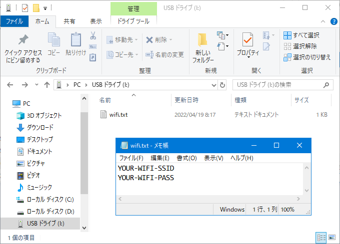

# WebRadio_Radiko

### 機能
- [WebRadio_with_ESP8266Audio](https://github.com/m5stack/M5Unified/tree/master/examples/Advanced/WebRadio_with_ESP8266Audio) をベースにして、[radiko(ラジコ)](https://radiko.jp/) が聴けるようにしました。
- 他のデバイス向けストリーミング配信と同様に、数分遅れでライブ放送を受信します。
- 選局と音量は不揮発性メモリに保存され、次回の起動時に初期採用されます。
- [リリースパッケージ](release/) も用意しました。Arduino 環境のない方でもインストールできます。

### WiFi設定
SDカードを用いて WiFi の設定が行えます。  
いったん接続に成功すれば、以降はSDカードは必要ありません。  
具体的な記述方法は [説明](sdcard/) をご覧ください。

### 操作方法
|ボタン|動作|
|:-------------:|:----:|
|Aボタン1回クリック|選局・次|
|Aボタン2回クリック|選局・前|
|Bボタン|音量・減|
|Cボタン|音量・増|

### ビルドに必要なライブラリ
- [espressif/arduino-esp32](https://github.com/espressif/arduino-esp32/releases/tag/2.0.2)
- [m5stack/M5GFX](https://github.com/m5stack/M5GFX)
- [m5stack/M5Unified](https://github.com/m5stack/M5Unified)
- [wakwak-koba/ESP8266Audio](https://github.com/wakwak-koba/ESP8266Audio) forked from [earlephilhower/ESP8266Audio](https://github.com/earlephilhower/ESP8266Audio)

### AAC-SBR を無効にするためライブラリを Fork しました
 ESP8266Audio の AACDecorder を ESP32 で利用すると、必ず SBR が有効になってしまいますが、SBR を有効にすると Radiko の受信には最大で4チャネル必要で、メモリー不足により安定して動作しませんでした。  
 元来は「HELIX_FEATURE_AUDIO_CODEC_AAC_SBR」という定数定義に基づいて SBR が有効になるべきだと思われるものの、ESP8266 以外で常に SBR が有効になる記述も別にあり、実質的には「HELIX_FEATURE_AUDIO_CODEC_AAC_SBR」が機能しない状態になってしまっています。  
 私としてはバグだと解釈しているのですが、AAC に関する知識も欠如しており Pull-Request を提出すべきか悩んでおり、とりあえず Fork したうえで該当箇所を修正しましたので、ビルドされる方は私が Fork したほうをご利用ください。

### 宣伝
M5Stack 等で JCBA インターネットサイマルラジオ 全132局 が聴ける [WebRadio_JCBA](https://github.com/wakwak-koba/WebRadio_Jcbasimul) も公開しています。

### 謝辞
かっこいいビジュアルは [lovyan03](https://github.com/lovyan03/) さんの制作です。  
ずっと見てても飽きないです！
